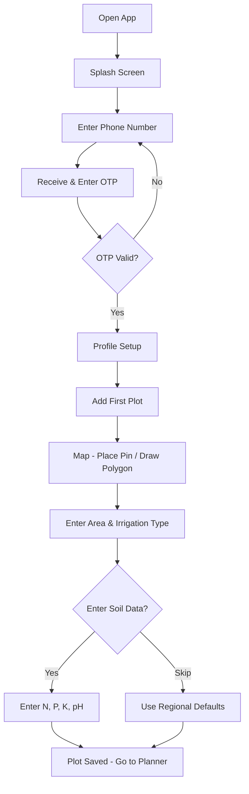
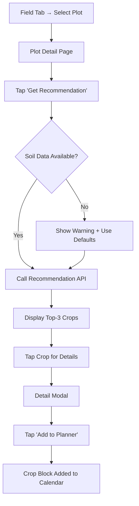
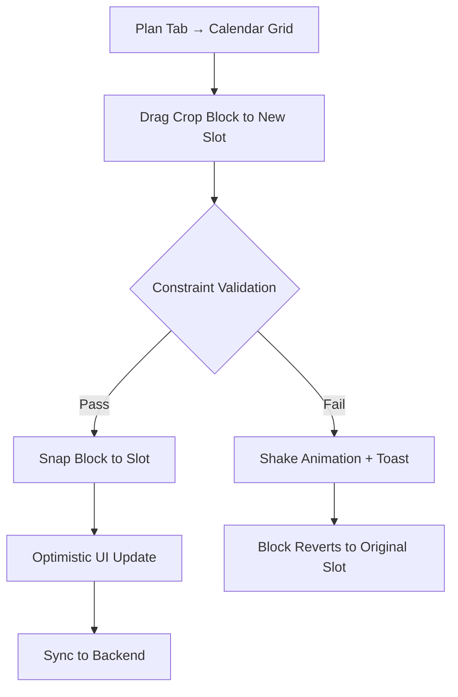
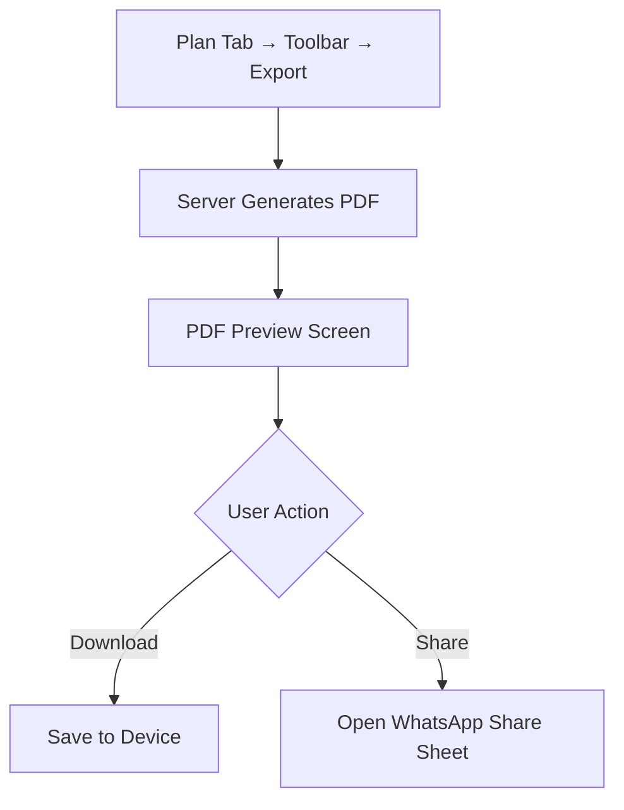

# Information Architecture — Smart Crop Advisory (SIH25010)

**Version:** 1.0
**Date:** 2026-03-07

---

## 1. Navigation Structure

### Primary Navigation (Bottom Tab Bar — Mobile)

```
┌──────────────────────────────────────────────┐
│   Plan    │   Field   │  Market  │  Profile  │
│   🗓️     │    🌾     │   📈    │    👤     │
└──────────────────────────────────────────────┘
```

| Tab | Destination | Primary Action |
|-----|-------------|----------------|
| **Plan** | Rotation Planner (home screen) | View/edit crop rotation calendar |
| **Field** | My Plots list + map | Manage plots, view soil & recommendations |
| **Market** | Mandi prices & trends | Browse prices, view forecasts |
| **Profile** | Settings, data, account | Language, notifications, export, logout |

### Secondary Navigation

| Item | Access Point | Description |
|------|-------------|-------------|
| Notifications Bell | Top-right header | Alert center (weather, sowing, price) |
| Search | Top header bar | Search across crops, plots, mandis |
| Help / FAQ | Profile → Help | Contextual help and onboarding tutorials |

---

## 2. Screen Inventory & Hierarchy

```
App Root
├── Onboarding Flow (first-time only)
│   ├── Welcome / Splash
│   ├── Phone OTP Login
│   ├── Profile Setup (name, language, district)
│   └── Add First Plot
│       ├── Map View (GPS auto-detect)
│       ├── Plot Details (area, irrigation)
│       └── Soil Data Entry (or skip)
│
├── Plan (Tab 1 — Home)
│   ├── Rotation Calendar Grid
│   │   ├── Crop Block (tap → detail modal)
│   │   ├── Empty Slot (tap → add crop / get recommendation)
│   │   └── Toolbar (undo, redo, export, share)
│   └── Plan Export (PDF preview → download)
│
├── Field (Tab 2)
│   ├── Plots List View
│   ├── Plots Map View
│   └── Plot Detail
│       ├── Summary Card (area, irrigation, soil status)
│       ├── Soil Health Dashboard
│       │   ├── NPK Bar Chart
│       │   ├── pH Indicator
│       │   └── Soil Test History
│       ├── Crop Recommendation
│       │   ├── Top-3 Results List
│       │   └── Recommendation Detail Modal
│       │       ├── Expected Yield
│       │       ├── Fertilizer Doses
│       │       ├── Sowing Window
│       │       └── Model Explanation
│       ├── Weather Forecast (7-day)
│       └── Last 3 Crops History
│
├── Market (Tab 3)
│   ├── Price List (filterable by crop, district)
│   ├── Price Trend Chart (7 / 14 / 30 day)
│   └── Price Prediction (dashed overlay) [v1]
│
├── Profile (Tab 4)
│   ├── Account Info (name, phone, language)
│   ├── Notification Preferences
│   │   ├── Channel Toggles (Push, SMS, WhatsApp)
│   │   └── Alert Type Toggles
│   ├── Language Selector
│   ├── Data Export / Delete
│   └── Help / FAQ / About
│
├── Notification Center (overlay)
│   ├── Weather Alerts
│   ├── Sowing Reminders
│   └── Market Alerts
│
└── Admin / Agronomist Portal (web only)
    ├── Farmer List + Search
    ├── Region Overview Map
    ├── Farmer Detail (read-only planner + notes)
    ├── Model Registry & Retraining Dashboard
    └── System Health / Observability
```

---

## 3. User Flows

### 3.1 First-Time Onboarding Flow



### 3.2 Get Crop Recommendation Flow



### 3.3 Plan Rotation Flow



### 3.4 Export & Share Flow



---

## 4. Content Model

### Content Types & Attributes

| Content Type | Attributes | Source |
|-------------|------------|--------|
| **Plot** | id, name, location (GPS/GeoJSON), area, irrigation_type, soil_summary | User input |
| **Soil Test** | id, plot_id, N, P, K, pH, test_date | User / lab input |
| **Crop Recommendation** | crop_name, score, reason, sowing_window, fertilizer_doses, model_version | ML engine |
| **Rotation Entry** | plot_id, crop, start_date, end_date, fertilizer_json | User / planner |
| **Weather Observation** | station_id, date, temp_min, temp_max, rainfall, humidity | Weather API |
| **Market Price** | crop, mandi, district, date, price_per_quintal | AGMARKNET |
| **Alert / Notification** | type, title, body, channel, timestamp, read_status | System-generated |
| **User Profile** | name, phone, language, role, district | User input |

### Content Relationships

```
User ──┬── 1:N ──── Plot
       │              │
       │              ├── 1:N ──── Soil Test
       │              ├── 1:N ──── Rotation Entry
       │              ├── 1:N ──── Recommendation Log
       │              └── 1:1 ──── Weather Station (mapped)
       │
       └── 1:N ──── Notification
```

---

## 5. URL / Route Structure (Web)

| Route | Page | Auth Required |
|-------|------|---------------|
| `/` | Landing / marketing page | No |
| `/login` | Phone OTP login | No |
| `/onboarding` | Profile + first plot setup | Yes |
| `/plan` | Rotation planner (home) | Yes |
| `/plan/export` | PDF export preview | Yes |
| `/fields` | Plot list / map view | Yes |
| `/fields/:plotId` | Plot detail | Yes |
| `/fields/:plotId/recommend` | Recommendation results | Yes |
| `/market` | Mandi price list | Yes |
| `/market/:crop` | Price trend for specific crop | Yes |
| `/profile` | Settings & preferences | Yes |
| `/profile/notifications` | Notification settings | Yes |
| `/profile/data` | Export / delete data | Yes |
| `/notifications` | Notification center | Yes |
| `/admin` | Admin / agronomist dashboard | Yes (role) |
| `/admin/farmers` | Farmer list | Yes (role) |
| `/admin/farmers/:userId` | Farmer detail (read-only) | Yes (role) |

---

## 6. State Management Model

| State Slice | Persistence | Sync Strategy |
|-------------|-------------|---------------|
| **Auth / Session** | JWT in secure storage | Refresh on expiry |
| **Plots** | Local cache + server | Fetch on mount; invalidate on mutation |
| **Planner State** | Local + server | Optimistic update → PUT on change |
| **Recommendations** | Cache with TTL (5 min) | Fetch on request |
| **Weather** | Cache with TTL (1 hour) | Background refresh |
| **Market Prices** | Cache with TTL (6 hours) | Fetch on tab visit |
| **Notifications** | Server-push → local list | WebSocket / polling |

---

## 7. Accessibility & Localization Architecture

### Accessibility
- All interactive elements have `aria-labels` and `role` attributes.
- Keyboard navigation for all planner interactions (arrow keys for grid).
- Minimum contrast ratio 4.5:1 enforced via design tokens.
- Screen reader announces drag-drop outcomes.

### Localization (i18n)
```
/src
  /i18n
    /en.json          # English strings
    /hi.json          # Hindi strings
    /[lang].json      # Extensible
```
- All UI strings referenced by key (never hardcoded).
- Date/number formats follow locale (`Intl` API).
- RTL layout support planned for Urdu (future).

---

## 8. Sitemap (Visual)

```
                    ┌─────────────┐
                    │   App Root   │
                    └──────┬──────┘
           ┌───────────────┼───────────────┬──────────────┐
     ┌─────▼─────┐  ┌──────▼──────┐ ┌──────▼──────┐ ┌────▼─────┐
     │   Plan     │  │   Fields    │ │   Market    │ │ Profile  │
     └─────┬─────┘  └──────┬──────┘ └──────┬──────┘ └────┬─────┘
           │                │               │              │
     ┌─────▼─────┐  ┌──────▼──────┐ ┌──────▼──────┐ ┌────▼──────┐
     │ Calendar   │  │ Plot List   │ │ Price List  │ │ Settings  │
     │ Grid       │  │ Plot Map    │ │ Trend Chart │ │ Notif.    │
     │ Export     │  │ Plot Detail │ │ Prediction  │ │ Data Mgmt │
     │ Share      │  │ Soil Dash   │ └─────────────┘ │ Help      │
     └───────────┘  │ Recommend   │                  └───────────┘
                    │ Weather     │
                    └─────────────┘
```
